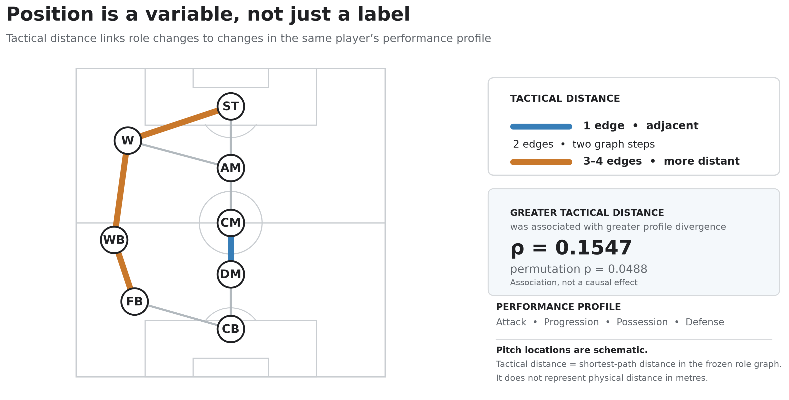
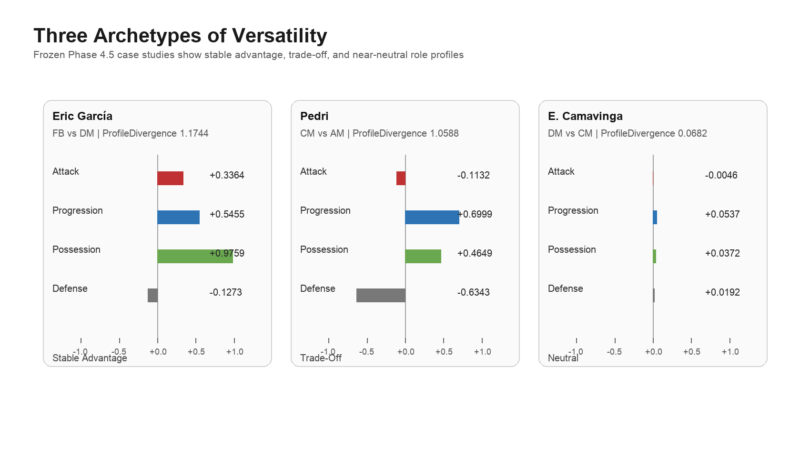

# Position as a Variable, Not a Label

### Tactical Distance and Role-Conditioned Performance in Versatile Footballers

**MIT Sloan Sports Analytics Conference — Problem 12**\
**Soccer**

> **Reproducibility status: partial.** Public code, frozen aggregate results, figures, and the
> two-page abstract are included. The row-level SoccerSolver source data are excluded because no
> redistribution licence was identified. See `data/README.md` and `docs/PUBLIC_RELEASE_AUDIT.md`.



## Research question

How does a versatile footballer's observed performance profile vary across tactical roles, and are
tactically more distant role changes associated with larger within-player profile changes?

## Dataset

The final analysis contains **23,627 player-match observations**, **120 versatile outfield players**,
and **159 within-player role comparisons**. A role sample enters the primary cohort when it has at
least **70% role purity**, **600 clean minutes**, and **8 qualifying matches**.

The studied outfield families are CB, FB, WB, DM, CM, AM, W, and ST. Formation-segment timing is
linked to player-match totals; goalkeeper transitions are not part of the reported cohort.

## Position as a variable

A versatile player may appear in several positions, but those roles do not necessarily ask for the
same things. Instead of treating position as one permanent player label, this study assigns a
dominant role family for each qualifying player-match and compares observed profiles within the same
player.

Four standardized dimensions describe each role-conditioned profile:

- **Attack**
- **Progression**
- **Possession**
- **Defense**

Profile divergence is the Euclidean distance across the four within-player score differences. It
summarizes how much the observed profile changes between two roles.

## Tactical distance and comparisons

Tactical distance is the shortest-path distance between role families in a frozen football-role
graph. It is not physical distance in metres; pitch placement in Figure 1 is schematic. Direct graph
neighbours have distance 1, while more distant pairs require multiple graph steps.

Each comparison is classified as a **stable advantage**, **trade-off**, **neutrality**, or
**insufficient evidence**. The framework also compares adjacent and cross-family transitions and
tests whether graph distance is associated with profile divergence.

## Main findings

| Result | Frozen estimate |
|---|---:|
| Stable advantage | **16 (10.06%)** |
| Trade-off | **36 (22.64%)** |
| Neutrality | **40 (25.16%)** |
| Insufficient evidence | **67 (42.14%)** |
| Cross-family minus adjacent divergence | **+0.1873** |
| 95% CI | **[0.0583, 0.3285]** |
| Cohen's d | **0.8939** |
| Tactical-distance Spearman ρ | **0.1547** |
| Permutation p | **0.0488** |
| Consensus-only difference | **+0.1854** |
| Consensus-only 95% CI | **[0.0565, 0.3241]** |

Greater tactical distance was associated with greater within-player profile divergence. This is an
observational association, not evidence that changing position causes performance to change. No
leave-one-player or leave-one-transition check reversed the headline direction.



Figure 2 provides three frozen examples: Eric García shows a stable FB–DM separation
(profile divergence **1.1744**), Pedri a CM–AM trade-off (**1.0588**), and E. Camavinga a
near-neutral DM–CM profile (**0.0682**). Bars show Role A minus Role B: red is Attack, blue is
Progression, green is Possession, and grey is Defense. Right of zero is higher in Role A; left is
lower, and bar length is the magnitude of the standardized score difference.

## Practical application

A club can apply the framework to its own qualifying player data to examine which roles have
produced similar profiles, where trade-offs appear, whether one role has shown a stable advantage,
and how tactically distant redeployments relate to observed profile changes. These comparisons can
inform selection, recruitment, squad planning, and role discussions.

The framework supports football decision-making; it does not automate the coach's or sporting
director's decision and does not identify an objectively best position.

## Paper

The final two-page MIT Sloan Problem 12 abstract is available here:

[Download the abstract (PDF)](paper/Problem12_Position_as_a_Variable_Not_a_Label.pdf)

The paper retains the unassigned Paper ID placeholder; no identifier has been invented.

## Reproduction

Python 3.12 was used for release testing.

```bash
python -m venv .venv
source .venv/bin/activate
python -m pip install -r requirements.txt
python scripts/verify_release.py
python src/build_figure1.py
```

The verification script checks the published scientific constants, role graph, required artifacts,
and frozen public file hashes. The figure script regenerates the white tactical-role map from the
included aggregate result file. Full recomputation from player-match rows requires an authorized
copy of the SoccerSolver source export and is not available from this public repository. See
`docs/reproducibility.md` and `docs/methodology.md`.

## Limitations

This is an observational study and does not establish causal effects. The source does not contain
tracking data, event coordinates, or event timestamps sufficient to assign individual actions to
exact within-match role segments. Player-match totals therefore cannot be divided perfectly across
tactical-role segments. Contextual confounding remains, and the results should not be interpreted
as automatic best-position recommendations.

---

## Researcher

<p align="left">
  
</p>

### Rupayan Halder

**PhD Student**\
Jadavpur University, Kolkata

**Football AI Researcher**

**Assistant Professor**\
University of Engineering & Management (UEM), Kolkata

**Research Collaborator**\
SoccerSolver

**Former Software Engineer — Platform Engineering**\
Session AI

Rupayan's research interests focus on applying artificial intelligence, machine learning, data
analytics, and computational methods to real-world problems in football, including player
performance analysis, recruitment, transfer-market decision-making, and sporting strategy.

### Connect

[GitHub](https://github.com/RupayanHalder39) ·
[LinkedIn](https://www.linkedin.com/in/rupayan-halder-962922209/) ·
[Email](mailto:rupayanhalder313239@gmail.com)

---

## Research Collaboration

<p align="left">
  
</p>

**This research was developed in collaboration with SoccerSolver. SoccerSolver currently works with more than 10 football clubs.**

---

## Citation

Use the metadata in `CITATION.cff`. This repository is a research and submission artifact; it does
not claim conference acceptance, a DOI, or an assigned paper ID.

## Licence

Original repository code and documentation are provided under the MIT License. This does not grant
rights to the underlying SoccerSolver or third-party data, names, marks, author photograph, logo,
paper, or other provider content. The raw and row-level data are not included. See
`docs/licensing.md` and `data/README.md`.
